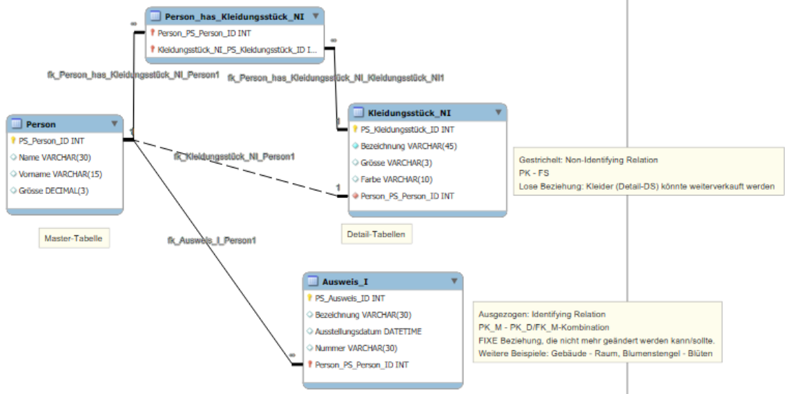

# 2. Identifying vs. Non-Identifying Relationships

## **1. Identifying Relationship („identifizierende Beziehung“)**

*   Der **Fremdschlüssel ist Teil des Primärschlüssels** der Kind-Tabelle.
*   Die **Kind-Entität kann nicht ohne die Eltern-Entität existieren** (Existenzabhängigkeit).
*   Wird häufig bei **Teil-von-Ganzem-Beziehungen** verwendet.
*   **Beispiel:** `Bestellung` (`BestellID`) -> `Bestellposition` (`BestellID` + `PositionsNr` als zusammengesetzter Primärschlüssel). Eine Bestellposition existiert **nur** im Kontext einer Bestellung.

## **2. Non-Identifying Relationship („nicht-identifizierende Beziehung“)**

*   Der **Fremdschlüssel ist ein normales Attribut** und *nicht* Teil des Primärschlüssels.
*   Die **Kind-Entität kann unabhängig existieren**.
*   Typisch für lose Beziehungen wie „gehört zu“ oder „arbeitet in“.
*   **Beispiel:** `Mitarbeiter` (`MitarbeiterID`, `AbteilungID`). Der Mitarbeiter bleibt die gleiche Entität, auch wenn er die Abteilung wechselt.

---

## **Beispiele und Anwendungsfälle**

### Eigene Beispiele

*   **Identifying:** `Projekt` -> `Projektaufgabe` (Eine Aufgabe ist nur im Kontext eines Projekts sinnvoll).
*   **Non-Identifying:** `Firma` -> `Mitarbeiter` (Ein Mitarbeiter existiert auch bei einem Firmenwechsel weiter).

### Typische Anwendungsfälle für Identifying Relationships

*   **Dokument -> Seiten**: Seiten existieren nur innerhalb eines Dokuments.
*   **Konto -> Transaktionen**: Eine Transaktion ist nur im Kontext eines Kontos eindeutig.
*   **Rezept -> Zutatenliste**: Die Zutaten sind spezifisch für das Rezept definiert.
*   **Flug -> Sitzplatzbuchung**: Eine Buchung ist ohne den Flug nicht sinnvoll.