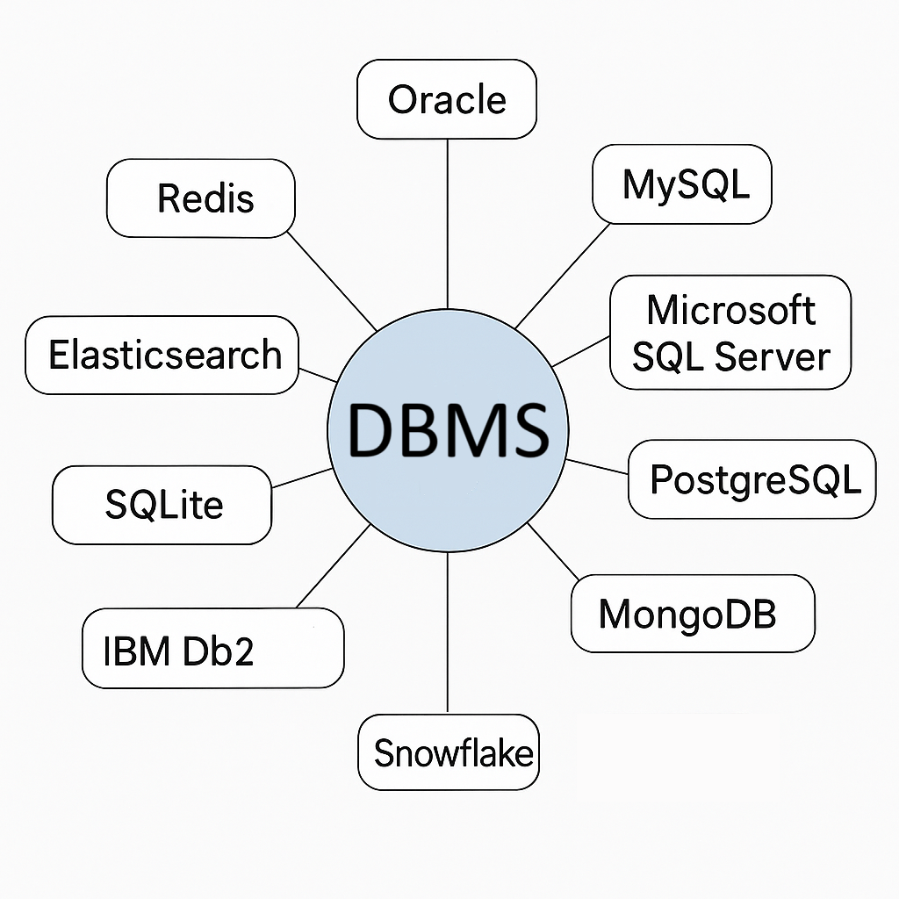

# 3. Grundlagen von Datenbanksystemen (DBS)

## **Definition und Aufgaben**

Ein **Datenbanksystem (DBS)** dient der elektronischen, dauerhaften und konsistenten Verwaltung großer Datenmengen. Es besteht aus dem **Datenbankmanagementsystem (DBMS)**, der Verwaltungssoftware, und der **Datenbank (DB)**, den gespeicherten Daten.

## **Merkmale eines DBMS**

*   **Integrierte Datenhaltung:** Zentrale, redundanzfreie Speicherung.
*   **Datenbanksprache:** Umfasst Teilsprachen wie DDL, DML, DQL, DCL, TCL.
*   **Katalog (Data Dictionary):** Verwaltung von Metadaten.
*   **Benutzersichten (Views):** Anpassbare Sichten für verschiedene Nutzergruppen.
*   **Konsistenzkontrolle:** Sicherung der Datenkorrektheit durch Constraints.
*   **Zugriffskontrolle:** Schutz vor unbefugtem Zugriff.
*   **Transaktionsverwaltung:** Änderungen erfolgen nach dem ACID-Prinzip (atomar, konsistent, isoliert, dauerhaft).
*   **Mehrbenutzerfähigkeit:** Synchronisation bei gleichzeitigen Zugriffen (Concurrency Control).
*   **Datensicherung und Recovery:** Wiederherstellung nach Fehlern.

---

## **Vor- und Nachteile**

| Vorteile | Nachteile |
| :--- | :--- |
| Standardisierung & Effizienz | Hohe Anschaffungskosten |
| Schnellere Anwendungsentwicklung | Komplexität & Overhead |
| Flexibilität & Datenunabhängigkeit | Erhöhte Kosten für Personal & Sicherheit |
| Hohe Verfügbarkeit & Sicherheit | Zentralisierung als Risikofaktor (Single Point of Failure) |

---

## **Überblick über Datenbankprodukte**

| Produkt | Hersteller | Modell/Charakteristik |
| :--- | :--- | :--- |
| **Oracle** | ORACLE | Objektrelational, Marktführer im Enterprise-Bereich |
| **MySQL** | MySQL AB (Oracle) | Relational, weit verbreitet für Webanwendungen |
| **MS SQL Server** | Microsoft | Objektrelational, stark im Windows-Umfeld |
| **PostgreSQL** | – | Objektrelational, Open Source, sehr funktionsreich |
| **DB2** | IBM | Objektrelational, oft auf Mainframes |
| **MS Access** | Microsoft | Relational, Desktop-System |
| **MariaDB** | MariaDB Corp. | Relational, Fork von MySQL |
| **SQLite** | D. Richard Hipp | Relational, serverlos, oft in mobilen Apps |
| **Teradata** | NCR Teradata | Hochleistungs-DBMS für Data Warehouses |
| **MongoDB** | MongoDB Inc. | Dokumentenorientiert (NoSQL) |

