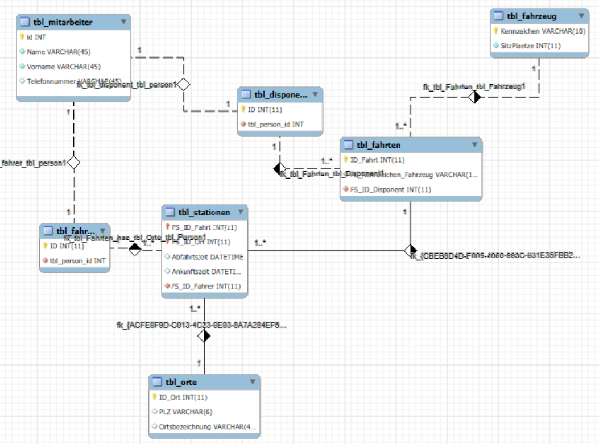
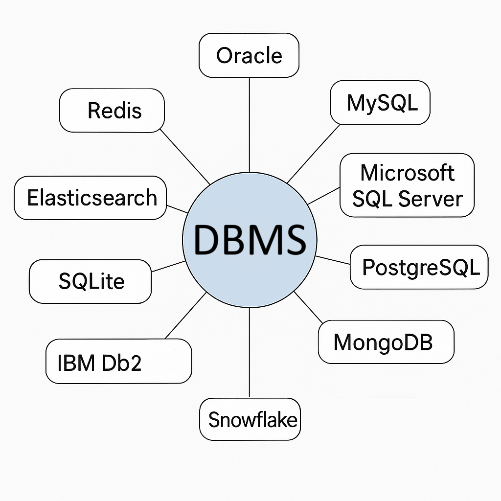

Teil 1
---
## **Theorie: Generalisierung & Spezialisierung in der Datenbankmodellierung**  
  
### **Ausgangslage**  
  
In datenbankgestützten Informationssystemen kommt es oft vor, dass mehrere **Entitätstypen viele gemeinsame Attribute besitzen**, z.B. Name, Adresse, Telefonnummer. Wenn diese mehrfach modelliert werden, entsteht **Redundanz**, was inkonsistenten Datenbestand und erhöhten Wartungsaufwand zur Folge haben kann.  
  
Beispiel:  
Ein Mitarbeiter kann gleichzeitig **Kunde** sein, oder ein **Fahrer** auch als **Disponent** tätig sein.  
  
---
  
### **Lösung: Generalisierung und Spezialisierung**  
  
#### **Generalisierung**  
  
Die gemeinsamen Attribute mehrerer Entitätstypen werden in einem **übergeordneten (allgemeinen) Entitätstyp** zusammengeführt.  
-> z.B. `Person` mit den Attributen: `Name`, `Adresse`, `Geburtsdatum`  
  
#### **Spezialisierung**  
  
Die **spezifischen Eigenschaften** verbleiben in den spezialisierten Entitätstypen.  
-> z.B. `Mitarbeiter`, `Kunde`, `Fahrer`, `Disponent` mit je eigenen Attributen.  
  
### **Technische Umsetzung**  
  
Die spezialisierten Entitäten referenzieren den generalisierten Entitätstyp über **Fremdschlüssel**.  
Dies bildet die **"is_a"-Beziehung** ab (z.B. "Ein Fahrer **ist eine** Person").  
  
---
  
### **Objektorientierte Parallele**  
  
In der objektorientierten Modellierung wird dieses Prinzip über **Vererbung** realisiert:  
`class Mitarbeiter extends Person { ... }`  
  
---
  
## **Screenshot mit Beispiel (Person <- Mitarbeiter, Person <- Kunde)**  
  
*(Beispielhafte ER-Modell-Darstellung)*  
  
Ich habe eine einfache Illustration generiert, die du verwenden kannst:  
  
  
---
  
## **Eigenes Beispiel zur Generalisierung**  
  
**Allgemeiner Entitätstyp:** `Fahrzeug`  
Attribute: `Fahrgestellnummer`, `Marke`, `Modell`, `Baujahr`  
  
**Spezialisierungen:**  
  
* `PKW` mit Attribut: `Anzahl_Sitze`  
* `LKW` mit Attribut: `Ladegewicht`  
* `Bus` mit Attribut: `Anzahl_Passagiere`  
  
Beziehungen:  
  
* `PKW` is_a `Fahrzeug`  
* `LKW` is_a `Fahrzeug`  
* `Bus` is_a `Fahrzeug`  
  
---
  
## **Weitere Beispiele aus dem Klassenumfeld (sammeln)**  
  
* `Gerät` -> `Laptop`, `Tablet`, `Smartphone`  
* `Buch` -> `E-Book`, `Printbuch`  
* `Nutzerkonto` -> `Admin`, `Standardbenutzer`, `Gast`  
  
---
  
## **KI-gestützte Umsetzung in der Praxis**  
  
### Beispiel in SQL (vereinfachtes Modell)  
  
```sql
-- Generalisierte Tabelle
CREATE TABLE Person (
    person_id INT PRIMARY KEY,
    name VARCHAR(100),
    adresse VARCHAR(255)
);

-- Spezialisierte Tabelle: Mitarbeiter
CREATE TABLE Mitarbeiter (
    person_id INT PRIMARY KEY,
    personalnummer VARCHAR(20),
    FOREIGN KEY (person_id) REFERENCES Person(person_id)
);

-- Spezialisierte Tabelle: Kunde
CREATE TABLE Kunde (
    person_id INT PRIMARY KEY,
    kundennummer VARCHAR(20),
    FOREIGN KEY (person_id) REFERENCES Person(person_id)
);
```
  
### Tipps:  
  
* In ORMs (z.B. Hibernate, Entity Framework) kann man Vererbung mit `@Inheritance`-Annotation oder `TPT`/`TPH`-Strategien umsetzen.  
* In NoSQL-Datenbanken ist die Modellierung anders - hier muss man sorgfältig entscheiden, ob man die Vererbung nachbilden will oder nicht.  
  
    
Teil 2
---
  
## **Theorie: Identifying und Non-Identifying Relationships**  
  
In relationalen Datenbanken unterscheidet man **zwei Haupttypen von Beziehungen** zwischen Entitäten:  
  
---
  
### **1. Identifying Relationship („identifizierende Beziehung“)**  
  
* Der **Fremdschlüssel ist Teil des Primärschlüssels** der Kind-Tabelle.  
* Die **Kind-Entität existiert nicht ohne die Parent-Entität**.  
* Die Beziehung ist **eng und existenzabhängig**.  
* Wird häufig bei **Teilen von Ganzem** verwendet (z. B. Räume in Gebäuden).  
 **Beispiel:**  
  
* `Gebäude` (BuildingID) -> `Raum` (BuildingID + RoomNumber als zusammengesetzter Primary Key)  
* Ein Raum existiert **nur im Kontext eines bestimmten Gebäudes**.  
  
---
  
### **2. Non-Identifying Relationship („nicht-identifizierende Beziehung“)**  
  
* Der **Fremdschlüssel ist *nicht* Teil des Primärschlüssels**.  
* Die **Kind-Entität kann unabhängig existieren**.  
* Die Beziehung ist **lose**.  
* Typisch für Beziehungen wie **„gehört zu“**, **„arbeitet in“**.  
 **Beispiel:**  
  
* `Mitarbeiter` (MitarbeiterID, AbteilungID)  
* Der Mitarbeiter bleibt die gleiche Entität, **auch wenn er die Abteilung wechselt**.  
  
---  
  
## **Screenshot-Beispiel: Person -- Kleidungsstück (Identifying), Person -- Ausweis (Non-Identifying)**  
  
Ich kann dir dazu eine Beispielgrafik generieren. Möchtest du sie als Bilddatei (z. B. PNG) haben?  
  
**Erklärung:**  
  
* `Kleidungsstück`: Identifying — Ein Kleidungsstück gehört eindeutig einer bestimmten Person.  
* `Ausweis`: Non-Identifying — Ein Ausweis gehört zwar einer Person, kann aber unabhängig verwaltet werden (z. B. wegen Nummerierung oder Behördenstruktur).  
  
---  
  
## **Eigenes Beispiel: Identifying Relationship**  
  
### **Bestellung -> Bestellposition**  
  
* `Bestellung` hat: `BestellID`  
* `Bestellposition` hat: `BestellID` + `PositionsNr` als zusammengesetzten Primärschlüssel  
  
**Warum sinnvoll?**  
  
* Eine **Bestellposition kann ohne Bestellung nicht existieren**.  
* Die Position wird durch die Bestellung eindeutig identifiziert.  
  
---  
  
## **Beispiele von Klassenkamerad\:innen (sammeln)**  
  
**Mögliche Vorschläge:**  
  
* `Kurs` -> `Kursteilnehmer` (Teilnehmer existieren auch ohne Kurs -> Non-Identifying)  
* `Projekt` -> `Projektaufgabe` (Aufgabe nur im Projekt sinnvoll -> Identifying)  
* `Auto` -> `Reifen` (Reifen als Teil eines Autos -> Identifying)  
* `Firma` -> `Mitarbeiter` (Mitarbeiter bleibt erhalten bei Firmenwechsel -> Non-Identifying)  
  
Du kannst die Mitschüler\:innen gezielt fragen oder eine kleine Umfrage machen.  
  
---
  
## **Anwendungsfälle für Identifying Relationships (über ChatGPT oder Phind recherchiert)**  
  
### Typische Anwendungsfälle:  
  
1. **Dokument -> Seiten**  
  
   * Seiten machen nur innerhalb eines Dokuments Sinn.  
2. **Konto -> Transaktionen**  
  
   * Eine Transaktion ist nur im Kontext eines Kontos eindeutig.  
3. **Rezept -> Zutat**  
  
   * Zutaten sind im Kontext des Rezepts definiert.  
4. **Flug -> Sitzplatzbuchung**  
  
   * Eine Sitzplatzbuchung ist ohne Flug nicht sinnvoll.  
  
### Warum verwenden?  
  
* Datenintegrität sichern (z. B. keine „verwaisten“ Kinddatensätze).  
* Modelliert natürliche Abhängigkeiten zwischen Entitäten.  
* Wird in physischen Datenbankdesigns häufig genutzt, um referentielle Integrität zu unterstützen.  
  
---
  
Wenn du möchtest, kann ich jetzt eine passende **Screenshot-Grafik mit beiden Beziehungsarten (Person – Kleidungsstück, Person – Ausweis)** für dich generieren. Möchtest du das Bild jetzt haben?  

  

Hier ist eine strukturierte und lernfreundliche **Zusammenfassung zum Thema "Datenbanksysteme (DBS)"** für dein Lernportfolio. Du kannst diesen Text direkt übernehmen oder an deine eigene Ausdrucksweise anpassen:


DBMS (Teil 3)
---
  
## **Zusammenfassung: Datenbanksysteme (DBS)**  
  
### **Definition und Aufgaben eines DBS**  
  
Ein **Datenbanksystem (DBS)** dient der elektronischen Verwaltung großer Datenmengen. Es speichert Daten **dauerhaft**, stellt sicher, dass sie **konsistent** bleiben, und erlaubt **bedarfsgerechten Zugriff** durch Benutzer und Programme.  
  
Ein DBS besteht aus:  
  
1. **DBMS (Datenbankmanagementsystem)** – die Software zur Verwaltung und Steuerung der Daten.  
2. **DB (Datenbank)** – die tatsächlich gespeicherten Daten.  
  
---
  
### **Aufgaben und Merkmale eines DBMS**  
  
#### **Integrierte Datenhaltung**  
  
* Zentrale Speicherung aller Daten (z. B. Kundennamen nur einmal speichern).  
* Unterstützung komplexer Beziehungen und Datenverknüpfungen.  
  
#### **Datenbanksprache**  
  
Ein DBMS bietet verschiedene Sprachbestandteile:  
  
* **DQL/DRL** (z. B. `SELECT`) – Datenabfragen  
* **DDL** (`CREATE`) – Definition von Tabellen & Strukturen  
* **DML** (`INSERT`, `UPDATE`) – Manipulation von Daten  
* **DCL** (`GRANT`) – Berechtigungssteuerung  
* **TCL** (`COMMIT`) – Transaktionssteuerung  
  
#### **Benutzeroberflächen**  
  
* SQL-Konsolen, APIs, GUIs, Webzugriff – angepasst an unterschiedliche Nutzergruppen.  
  
#### **Katalog (Data Dictionary)**  
  
* Verwaltung der **Metadaten** (z. B. Tabellenstrukturen, Datentypen).  
  
#### **Benutzersichten (Views)**  
  
* Unterschiedliche Sichten für unterschiedliche Benutzer (z. B. Buchhaltung vs. Management).  
  
#### **Konsistenzkontrolle**  
  
* Sicherung korrekter Daten durch **Constraints** (Integritätsbedingungen).  
  
#### **Datenzugriffskontrolle**  

* Schutz vor unbefugtem Zugriff durch Benutzerrechte und Zugriffsbeschränkungen.  
  
#### **Transaktionen**  
  
* Änderungen erfolgen **atomar**, sind **dauerhaft** und folgen dem **ACID-Prinzip**.  
  
#### **Mehrbenutzerfähigkeit**  
  
* **Isolation und Synchronisation** bei gleichzeitigen Zugriffen (Concurrency Control).  
  
#### **Datensicherung**  
  
* Wiederherstellung bei Fehlern (Recovery-Funktionalität).  
  
---
  
### **Vorteile eines DBMS**  
  
* **Standardisierung** von Datenformaten, Begriffen, Schlüsseln.  
* **Effizienter Zugriff** auf große Datenmengen.  
* **Schnellere Anwendungsentwicklung** durch Wiederverwendbarkeit von Funktionen.  
* **Flexibilität** bei Änderungen der Datenstruktur (Datenunabhängigkeit).  
* **Hohe Verfügbarkeit** durch Synchronisierung und Transaktionssicherheit.  
* **Zentralisierung spart Kosten** (Hardware, Wartung).  
  
---
  
### **Nachteile eines DBMS**  
  
* **Hohe Anschaffungskosten** für Software & Hardware.  
* **Komplexität & Overhead** bei einfachen Anwendungen.  
* **Mehrkosten** für Datensicherheit, Redundanzfreiheit, Personal.  
* **Zentralisierung als Risikofaktor** (möglicher Single Point of Failure).  
  
---
  
### **Wann lieber keine Datenbank?**  
  
* Kein Mehrbenutzerzugriff notwendig.  
* Echtzeitanforderungen, die ein DBMS nicht erfüllt.  
* Sehr einfache, unveränderliche Datenstruktur.  
  
---
  
## **Überblick über Datenbankprodukte**  
  
| Produkt           | Hersteller   | Modell/Charakteristik                         |
| ----------------- | ------------ | --------------------------------------------- |
| **Adabas**        | Software AG  | NF2-Modell (nicht normalisiert)               |
| **Cache**         | InterSystems | Hierarchisch, „postrelational“                |
| **DB2**           | IBM          | Objektrelational                              |
| **Firebird**      | –            | Relational, basiert auf InterBase             |
| **IMS**           | IBM          | Hierarchisch, für Mainframes                  |
| **Informix**      | IBM          | Objektrelational                              |
| **InterBase**     | Borland      | Relational                                    |
| **MS Access**     | Microsoft    | Relational, Desktop-System                    |
| **MS SQL Server** | Microsoft    | Objektrelational                              |
| **MySQL**         | MySQL AB     | Relational                                    |
| **Oracle**        | ORACLE       | Objektrelational                              |
| **PostgreSQL**    | –            | Objektrelational, basiert auf Ingres/Postgres |
| **Sybase ASE**    | Sybase       | Relational                                    |
| **Versant**       | Versant      | Objektorientiert                              |
| **Visual FoxPro** | Microsoft    | Relational, Desktop-System                    |
| **Teradata**      | NCR Teradata | Hochleistungs-DBMS, für Data Warehouses       |

## Die 10 Wichtigsten DBMS

  
---
  
### **Zusammenfassung in Stichpunkten für Prüfungen**  
  
* **DBS = DBMS + Datenbank**  
* **Sprachen:** DQL, DDL, DML, DCL, TCL  
* **Merkmale:** Konsistenz, Sicherheit, Mehrbenutzerbetrieb, Transaktionen  
* **Vorteile:** Zentral, effizient, flexibel  
* **Nachteile:** Teuer, komplex, spezialisiertes Personal notwendig  
* **Typische Produkte:** MySQL, Oracle, PostgreSQL, MS SQL Server, DB2  

DDL (Teil 4)
---
  
## **Repetition ÜK Modul 106 – DDL: Anlegen einer Datenbank in MySQL**
  
### **1. Grundverständnis**
  
* In **MySQL** ist ein **Schema** dasselbe wie eine **Datenbank**.
* Ein **Datenbanksystem (DBS)** enthält **mehrere Datenbanken (Schemas)**.
* Eine **Datenbank** enthält **mehrere Tabellen**, die logisch gruppiert sind.
  
Ziel: Mehr Ordnung, bessere Strukturierung und Trennung der Daten durch mehrere Schemata im gleichen System.  
  
---
  
### **2. SQL-Befehl zum Anlegen einer Datenbank**
  
```sql
CREATE DATABASE beispiel_datenbank
  DEFAULT CHARACTER SET utf8mb4
  COLLATE utf8mb4_general_ci;
```
  
**Erklärung:**
  
* `CREATE DATABASE` – erstellt eine neue Datenbank.
* `DEFAULT CHARACTER SET` – legt den Standard-Zeichensatz fest (z. B. `utf8mb4` für Unicode).
* `COLLATE` – bestimmt die Sortierreihenfolge und Vergleichslogik.
  
---
  
### **3. Zeichensätze (Character Sets)**
  
#### ASCII (veraltet)
  
* 7-Bit, 128 Zeichen
* Nur englischer Zeichensatz
* Kein Umlaut, kein Unicode
  
#### ANSI / ISO-8859-1 (Latin1)
  
* 8-Bit, geeignet für Westeuropa
* Enthält Umlaute und Sonderzeichen
* Wird heute kaum noch für neue Systeme verwendet
  
#### **Unicode** – universeller Standard
  
##### UTF-8 (am häufigsten verwendet)
  
* **Flexibel:** 1 bis 4 Byte pro Zeichen
* **Abwärtskompatibel zu ASCII**
* Standard für > 95 % aller Websites
  
##### UTF-16 / UTF-32
  
* Fixe Zeichengröße (2 oder 4 Byte)
* Wird u. a. in **Java** oder **Windows intern** verwendet
* Höherer Speicherverbrauch als UTF-8
  
Empfehlung: **UTF-8 oder UTF-8MB4** verwenden, da diese Emojis, Sonderzeichen und viele Sprachen unterstützen.  
  
---
  
### **4. Wichtige Hinweise zum Anlegen von Datenbanken**
  
* Zeichensatz bei Bedarf **auf Tabellen- oder Spaltenebene überschreiben**:
  
  ```sql
  CREATE TABLE beispiel_tabelle (
      name VARCHAR(100)
  ) CHARACTER SET utf8mb4;
  ```
  
* **DB-Schema gut strukturieren** (z. B. nach Modulen, Kunden oder Projekten trennen).
  
* MySQL / MariaDB Referenzdokumentation nutzen.
  
---
  
### **Beispiel**
  
```sql
CREATE DATABASE firma2025
  DEFAULT CHARACTER SET utf8mb4
  COLLATE utf8mb4_unicode_ci;
  
USE firma2025;
  
CREATE TABLE mitarbeiter (
  id INT PRIMARY KEY,
  vorname VARCHAR(50),
  nachname VARCHAR(50),
  email VARCHAR(100)
) CHARACTER SET utf8mb4;
```
